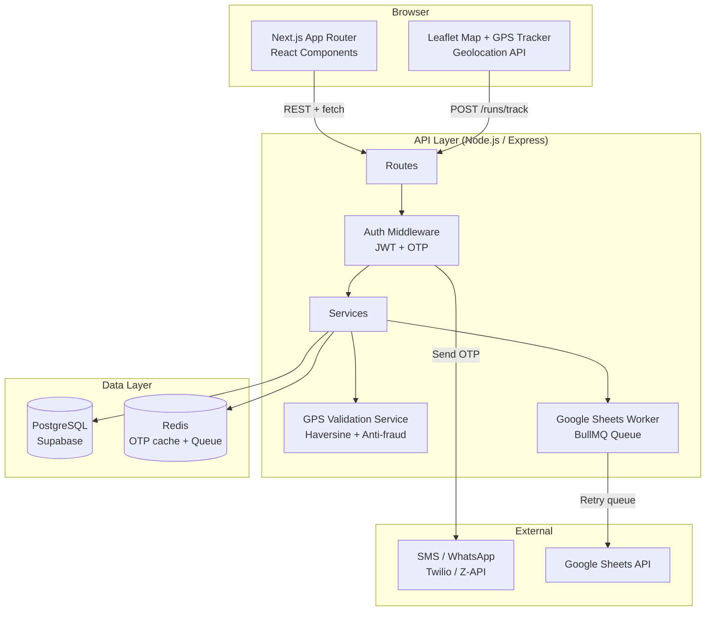
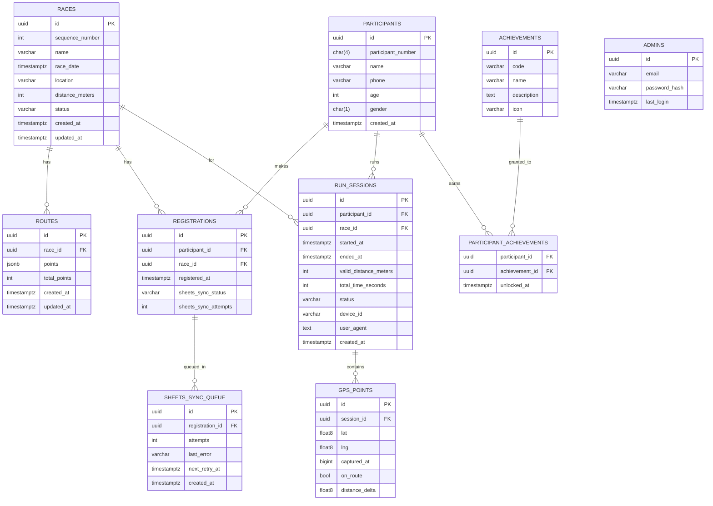

# Design Document – IMW Run

## Overview

O IMW Run é uma plataforma web **mobile-first** de corrida cristã que organiza uma jornada anual de 12 corridas de 5 km. O sistema é composto por uma SPA/SSR em Next.js servida ao browser, uma API REST em Node.js e um banco PostgreSQL (via Supabase ou instância dedicada). A experiência central do participante envolve inscrição simplificada (nome + telefone + idade), autenticação OTP por SMS/WhatsApp, rastreamento GPS em tempo real durante a corrida e visualização de progresso pessoal e ranking comunitário.

**Decisões de arquitetura chave:**

| Decisão | Escolha | Justificativa |
|---|---|---|
| Frontend | Next.js 14 (App Router) + Tailwind CSS | SSR para SEO, routing baseado em sistema de arquivos, ecossistema React |
| Backend | Node.js (Express ou Fastify) + TypeScript | Mesma linguagem frontend/backend, tipagem forte |
| Banco de dados | PostgreSQL via Supabase | Row-Level Security nativo, realtime, storage, facilidade de deploy |
| Mapa | Leaflet + OpenStreetMap (Tile Server) | Open-source, sem custo por requisição, boa API móvel |
| Autenticação participante | OTP 6 dígitos via SMS/WhatsApp (Twilio ou Z-API) | Sem senha, acesso rápido via celular |
| Autenticação admin | JWT com email/senha (bcrypt hash) | Controle tradicional com sessão stateless |
| GPS validation | Server-side apenas (Haversine) | Anti-fraude: cliente não pode falsificar distância |
| Google Sheets sync | googleapis SDK com retry queue (Bull/BullMQ) | Resiliência a falhas transitórias |

---

## Architecture

### Visão Geral de Camadas



### Fluxo de Dados Críticos

**Fluxo de Rastreamento GPS:**
```
Browser (5s interval)
  → POST /api/runs/{sessionId}/track  { lat, lng, timestamp }
  → GPS Validation Service
      ├─ Haversine distance to previous point
      ├─ Speed check (> 25 km/h → reject point)
      ├─ Buffer check (30m from route polyline → count/discard)
      └─ Accumulate valid_distance in Redis session
  → Response: { valid_distance, elapsed_time, on_route }
```

**Fluxo de Autenticação OTP:**
```
POST /api/auth/request-otp  { phone, channel: 'sms'|'whatsapp' }
  → Rate limit check (Redis: max 5 codes/60min per phone)
  → Generate 6-digit code, store in Redis (TTL 10min)
  → Send via SMS/WhatsApp provider
  → Response: { expires_at }

POST /api/auth/verify-otp  { phone, code }
  → Fetch code from Redis
  → Attempt counter check (max 3 per code)
  → If valid: issue JWT (30-day sliding window)
  → If invalid: increment counter, error response
```

---

## Components and Interfaces

### Frontend Components (Next.js App Router)

```
app/
├── (public)/
│   ├── page.tsx                    # Página inicial
│   ├── calendar/page.tsx           # Calendário das 12 corridas
│   ├── ranking/page.tsx            # Ranking público
│   └── race/[id]/
│       ├── page.tsx                # Detalhes da corrida
│       └── map/page.tsx            # Mapa do percurso
├── (auth)/
│   ├── login/page.tsx              # Auth OTP participante
│   └── profile/page.tsx            # Perfil do participante
│   └── run/[raceId]/page.tsx       # Tela de corrida + GPS tracker
├── admin/
│   ├── login/page.tsx              # Login admin (email/senha)
│   ├── dashboard/page.tsx          # Dashboard estatísticas
│   ├── races/
│   │   ├── page.tsx                # Lista corridas
│   │   └── [id]/
│   │       ├── edit/page.tsx       # Editar corrida
│   │       └── route/page.tsx      # Editar percurso
│   └── registrations/[raceId]/page.tsx  # Lista inscritos + CSV
└── api/                            # Next.js API routes (proxy thin layer)
```

**Componentes React reutilizáveis:**

| Componente | Descrição |
|---|---|
| `<JourneyTrack />` | Sequência visual das 12 corridas com estados e animação de unlock |
| `<RouteMap />` | Mapa Leaflet com polilinha do percurso, marcadores início/fim |
| `<LiveTracker />` | Mapa com posição em tempo real + contador de distância |
| `<RankingTable />` | Tabela de ranking com filtros mutuamente exclusivos |
| `<OtpForm />` | Formulário de telefone + input de 6 dígitos |
| `<ProgressBar />` | Barra de progresso 0–100% |
| `<AchievementBadge />` | Badge com animação de desbloqueio (1–3s) |
| `<BottomNav />` | Barra de navegação inferior (< 768px) |

### API REST Endpoints

**Autenticação Participantes**
```
POST /api/auth/request-otp     Solicita código OTP (rate limit 5/60min)
POST /api/auth/verify-otp      Verifica código, retorna JWT
POST /api/auth/logout          Invalida sessão
```

**Participantes (requer auth participante)**
```
GET  /api/profile              Perfil + progresso + conquistas
```

**Corridas (público)**
```
GET  /api/races                Lista corridas com status
GET  /api/races/:id            Detalhes de uma corrida
GET  /api/races/:id/route      Percurso da corrida (coordenadas)
```

**Inscrição (público)**
```
POST /api/registrations        Inscrever participante em corrida
```

**Rastreamento GPS (requer auth participante)**
```
POST /api/runs/start           Inicia sessão de corrida → sessionId
POST /api/runs/:sessionId/track   Envia ponto GPS (5s interval)
POST /api/runs/:sessionId/finish  Encerra corrida manualmente
GET  /api/runs/:sessionId/status  Status atual da sessão
```

**Ranking (público)**
```
GET  /api/ranking              Ranking com query params: filter, raceId, page
```

**Admin (requer auth admin)**
```
POST /api/admin/auth/login     Login admin
POST /api/admin/auth/logout    Logout admin

GET    /api/admin/races             Lista corridas
POST   /api/admin/races             Cria corrida
PUT    /api/admin/races/:id         Edita corrida
DELETE /api/admin/races/:id         Exclui corrida
PATCH  /api/admin/races/:id/status  Altera status corrida

POST /api/admin/races/:id/route     Salva percurso

GET  /api/admin/races/:id/registrations       Lista inscritos
GET  /api/admin/races/:id/registrations/csv   Exporta CSV

GET  /api/admin/dashboard    Estatísticas gerais

GET  /api/admin/results/pending   Resultados pendentes de revisão
```

### Interfaces TypeScript Principais

```typescript
interface Race {
  id: string;
  sequenceNumber: number; // 1-12
  name: string;
  date: Date;
  location: string;
  distanceMeters: number; // always 5000
  status: 'locked' | 'available' | 'ongoing' | 'finished';
  hasRoute: boolean;
}

interface RoutePoint {
  order: number;
  lat: number;
  lng: number;
}

interface Route {
  raceId: string;
  points: RoutePoint[]; // min 3, max 500
  startPoint: RoutePoint;
  endPoint: RoutePoint;
}

interface Participant {
  id: string;
  participantNumber: string; // zero-padded 4 digits
  name: string;
  phone: string;
  age: number;
  gender?: 'M' | 'F';
  registeredAt: Date;
}

interface Registration {
  participantId: string;
  raceId: string;
  registeredAt: Date;
}

interface RunSession {
  id: string;
  participantId: string;
  raceId: string;
  startedAt: Date;
  endedAt?: Date;
  validDistanceMeters: number;
  totalTimeSeconds: number;
  gpsPoints: GpsPoint[];
  deviceId: string;
  userAgent: string;
  status: 'active' | 'completed' | 'manual_stop' | 'pending_review' | 'rejected';
}

interface GpsPoint {
  lat: number;
  lng: number;
  timestamp: number; // Unix ms
  onRoute: boolean;
  distanceDelta: number; // meters accumulated from previous point
}

interface RankingEntry {
  position: number;
  name: string;
  racesCompleted: number;
  totalKm: number;
}

interface OtpRecord {
  phone: string;
  code: string; // 6-digit hashed
  expiresAt: Date;
  attempts: number;
  invalidated: boolean;
}
```

---

## Data Models

### Diagrama Entidade-Relacionamento



### Índices e Constraints Relevantes

```sql
-- Participante único por corrida (telefone)
UNIQUE INDEX idx_registrations_phone_race
  ON registrations (participant_id, race_id);

-- Número de participante único global
UNIQUE INDEX idx_participants_number
  ON participants (participant_number);

-- Telefone único entre participantes
UNIQUE INDEX idx_participants_phone
  ON participants (phone);

-- Sessão ativa por participante/corrida
-- (somente 1 sessão ativa por vez)
UNIQUE INDEX idx_active_session
  ON run_sessions (participant_id, race_id)
  WHERE status = 'active';

-- Ranking query performance
INDEX idx_run_sessions_completed
  ON run_sessions (participant_id, race_id, status, valid_distance_meters)
  WHERE status = 'completed';

-- GPS points por sessão (ordered)
INDEX idx_gps_points_session_time
  ON gps_points (session_id, captured_at);

-- Constraint: sequence_number 1-12
CHECK (sequence_number BETWEEN 1 AND 12);

-- Constraint: máximo 9999 participantes
-- (enforced via application layer + sequence)
```

### Redis Keys

```
otp:{phone}               → { code_hash, attempts, expires_at }   TTL: 10min
otp_rate:{phone}          → counter                               TTL: 60min sliding
session:{participantId}   → JWT payload                           TTL: 30 days sliding
run_session:{sessionId}   → { validDistance, lastPoint, startedAt, raceId }   TTL: 4h
```

---

## Correctness Properties

*A property is a characteristic or behavior that should hold true across all valid executions of a system — essentially, a formal statement about what the system should do. Properties serve as the bridge between human-readable specifications and machine-verifiable correctness guarantees.*

**Reflexão de Redundâncias:**
- 1.3 (sem corridas → oculta botões) está subsumido pela property 1.2 (exibe se e somente se corrida disponível)
- 6.7 (fora do buffer não acumula) está subsumido pela property 6.5-6.6 (acumula apenas dentro do buffer)
- 7.3 (completa corrida com 5000m) está subsumido pela property 7.1
- 7.7 (stop manual sem 5000m) está subsumido pela property 7.6
- 9.2-9.3 (display 12 corridas + barra progresso) estão subsumidos pela property 9.1
- 10.5 (invalida após 3x) está subsumido pela property 10.4
- 13.4 (preserva GPS para auditoria) está subsumido pelas properties 13.1 e 13.2

---

### Property 1: Exibição condicional de informações de corrida

*For any* conjunto de corridas cadastradas no sistema, a página inicial deve exibir as informações da próxima corrida (data, horário, local, distância) e os botões de ação se e somente se existe ao menos uma corrida com status `available` ou `ongoing`. Quando nenhuma corrida satisfaz essa condição, os botões "Inscreva-se" e "Ver percurso" não devem ser exibidos.

**Validates: Requirements 1.2, 1.3, 1.4**

---

### Property 2: Botão "Ver percurso" condicional ao percurso

*For any* corrida, o botão "Ver percurso" deve aparecer na página inicial se e somente se a corrida tem status `available` ou `ongoing` **e** possui percurso cadastrado (`has_route = true`). Para corridas sem percurso cadastrado, o botão nunca deve ser exibido.

**Validates: Requirements 1.5**

---

### Property 3: Jornada bloqueada para não autenticados

*For any* estado de dados de corridas no sistema, quando o visitante não está autenticado, todos os 12 ícones da seção "Sua Jornada" devem exibir estado bloqueado (cadeado fechado), independentemente do progresso de qualquer participante.

**Validates: Requirements 1.7**

---

### Property 4: Progressão visual da jornada

*For any* valor de N no intervalo [1, 11], se o participante autenticado completou exatamente as N primeiras corridas, então a corrida N deve ser exibida com estado "concluída" e a corrida N+1 deve ser exibida com estado "desbloqueada". Para N = 12, apenas a corrida 12 é exibida como concluída.

**Validates: Requirements 1.8, 4.4**

---

### Property 5: Unicidade do número de participante

*For any* sequência de inscrições válidas submetidas ao sistema, todos os números de participante gerados devem ser únicos, seguir o formato numérico com 4 dígitos com zero-padding (ex: `0001`, `0042`, `0999`) e não haver colisões entre si.

**Validates: Requirements 2.3**

---

### Property 6: Round-trip de dados de inscrição

*For any* combinação válida de (nome: 2–100 chars, telefone: 10–11 dígitos, idade: 1–120) com checkbox marcado, após a inscrição ser registrada com sucesso, recuperar o registro do banco de dados deve retornar exatamente os mesmos valores de nome, telefone, idade, número de participante gerado e identificador da corrida.

**Validates: Requirements 2.4**

---

### Property 7: Validação de formulário de inscrição

*For any* submissão de formulário de inscrição com pelo menos um campo inválido (nome vazio, telefone com número errado de dígitos, idade fora de [1,120], ou checkbox desmarcado), o sistema deve retornar pelo menos um erro identificando o campo e a regra violada, sem criar nenhum registro.

**Validates: Requirements 2.5**

---

### Property 8: Rejeição de telefone duplicado por corrida

*For any* corrida e *for any* número de telefone já registrado nessa corrida, uma nova tentativa de inscrição com o mesmo telefone nessa corrida deve ser rejeitada com mensagem de duplicata, sem criar um segundo registro.

**Validates: Requirements 2.6**

---

### Property 9: Resiliência da inscrição ao sync do Sheets

*For any* resultado da sincronização com o Google Sheets (sucesso, falha na primeira tentativa, falha em todas as tentativas, timeout), a inscrição do participante deve estar persistida no banco de dados principal. O resultado do sync nunca deve determinar o sucesso ou falha da inscrição.

**Validates: Requirements 3.4**

---

### Property 10: Lógica de retry do sync com Google Sheets

*For any* falha de sincronização simulada, o worker de retry deve realizar exatamente 3 tentativas de reenvio, com intervalo mínimo de 30 segundos entre cada tentativa, antes de marcar o registro como falho e enfileirar para reprocessamento.

**Validates: Requirements 3.3, 3.5**

---

### Property 11: Transição de status de corridas

*For any* participante e *for any* N em [1, 11]: quando o participante conclui a corrida N com `valid_distance >= 5000m`, o status da corrida N deve transitar para `finished` e o status da corrida N+1 deve transitar de `locked` para `available`. Para N = 12, apenas a corrida 12 transita para `finished`.

**Validates: Requirements 4.4**

---

### Property 12: Round-trip de sequência de percurso

*For any* sequência válida de coordenadas geográficas com tamanho entre 3 e 500 pontos, após salvar o percurso e recuperá-lo do banco de dados, a sequência retornada deve ser idêntica à sequência original na mesma ordem exata, com os mesmos valores de lat/lng para cada posição.

**Validates: Requirements 5.4, 5.6**

---

### Property 13: Acúmulo de distância apenas dentro do buffer

*For any* sequência de pontos GPS capturados durante uma sessão de corrida, a `valid_distance` acumulada deve ser igual à soma das distâncias Haversine entre pontos consecutivos cujas posições estão a 30 metros ou menos do percurso oficial. Pontos fora do buffer de 30m não devem contribuir com nenhum valor à `valid_distance`.

**Validates: Requirements 6.5, 6.6, 6.7**

---

### Property 14: Filtragem de pontos GPS inconsistentes (anti-salto)

*For any* par de pontos GPS consecutivos onde a distância Haversine dividida pelo intervalo de tempo é superior a aproximadamente 6,94 m/s (equivalente a 25 km/h), o segundo ponto deve ser descartado pelo GPS Validation Service e não deve contribuir para a `valid_distance`, nem o par deve ser contabilizado como deslocamento válido.

**Validates: Requirements 6.9, 13.2**

---

### Property 15: Finalização automática ao atingir 5000m válidos

*For any* sessão de corrida ativa, quando a `valid_distance` acumulada atingir exatamente ou ultrapassar 5000 metros, a sessão deve ser encerrada automaticamente pelo sistema com status `completed`, independentemente do tempo decorrido ou da distância total percorrida.

**Validates: Requirements 7.1**

---

### Property 16: Corrida concluída se e somente se valid_distance >= 5000m

*For any* sessão de corrida encerrada (automática ou manualmente), `is_completed = true` se e somente se `valid_distance_meters >= 5000`. A distância total percorrida (incluindo trechos fora do percurso) nunca deve influenciar o status de conclusão.

**Validates: Requirements 7.6, 7.7**

---

### Property 17: Cálculo correto dos dados de conclusão

*For any* sessão de corrida encerrada com `total_time_seconds > 0` e `valid_distance_meters > 0`, o ritmo médio exibido na tela de conclusão deve ser matematicamente correto: `avg_pace = (total_time_seconds / 60) / (valid_distance_meters / 1000)` minutos por km, com precisão de 2 casas decimais.

**Validates: Requirements 7.2**

---

### Property 18: Round-trip de dados de resultado de corrida

*For any* sessão de corrida encerrada com sucesso, recuperar o registro do banco deve retornar todos os campos obrigatórios: `participant_id`, `race_id`, `total_time_seconds`, `valid_distance_meters`, `avg_pace`, `completed_at` (UTC), `status` e `device_id`.

**Validates: Requirements 7.4**

---

### Property 19: Ordenação correta do ranking

*For any* conjunto de participantes com resultados registrados, a lista de ranking deve ser ordenada: (1º) por `races_completed` decrescente, (2º) por `total_km` decrescente como desempate, (3º) por `name` em ordem alfabética crescente como segundo desempate. Para qualquer par de entradas, a ordem relativa deve respeitar estritamente esses critérios.

**Validates: Requirements 8.2**

---

### Property 20: Filtros do ranking retornam apenas participantes correspondentes

*For any* filtro selecionado no ranking (gênero M/F, faixa etária 18–29/30–39/40–49/50–59/60+, ou corrida específica), todos os participantes retornados devem satisfazer o critério do filtro. Nenhum participante fora do critério deve aparecer nos resultados.

**Validates: Requirements 8.3**

---

### Property 21: Dados pessoais sensíveis ausentes do ranking

*For any* entry retornada pelo endpoint de ranking (`GET /api/ranking`), o objeto de resposta não deve conter nenhum dos campos: `phone`, `email`, `cpf`, `address`, `document` ou qualquer outro dado de identificação pessoal. Apenas `position`, `name`, `races_completed` e `total_km` devem estar presentes.

**Validates: Requirements 8.4**

---

### Property 22: Filtro de corridas com conclusões

*For any* estado do banco de dados, o dropdown de filtro por "corrida específica" no ranking deve conter somente corridas para as quais existe ao menos uma sessão com `status = 'completed'`. Corridas sem nenhum resultado concluído não devem aparecer no filtro.

**Validates: Requirements 8.6**

---

### Property 23: Cálculo correto de métricas do perfil

*For any* participante com N corridas concluídas e D metros de `valid_distance` acumulada, a página de perfil deve exibir: progresso = `ROUND(N / 12 * 100)` (inteiro, 0–100), distância total = `D / 1000` em km com 1 casa decimal, e corridas concluídas no formato `"N/12"`.

**Validates: Requirements 9.1, 9.3**

---

### Property 24: Conquistas persistidas e recuperáveis no perfil

*For any* conquista desbloqueada para um participante, recuperar o perfil desse participante deve retornar a conquista na seção de conquistas com `name` e `description` corretos e `unlocked_at` preenchido. Conquistas não desbloqueadas não devem aparecer.

**Validates: Requirements 9.4**

---

### Property 25: Isolamento de perfil entre participantes

*For any* par de participantes distintos (A ≠ B), quando o participante A está autenticado e tenta acessar o endpoint de perfil com o ID do participante B, o sistema deve retornar HTTP 403 (ou redirect para o perfil de A), sem expor nenhum dado de B.

**Validates: Requirements 9.5, 9.6**

---

### Property 26: Propriedades do código OTP gerado

*For any* telefone de participante cadastrado que solicita um código OTP, o código gerado deve: (a) conter exatamente 6 dígitos numéricos, (b) ter TTL de 10 minutos a partir do momento de geração, (c) ser distinto do código anterior (se houver).

**Validates: Requirements 10.2**

---

### Property 27: Limite de tentativas incorretas de OTP

*For any* código OTP válido, após 3 tentativas de verificação com código incorreto, o código deve ser marcado como invalidado e tentativas subsequentes (corretas ou incorretas) devem ser rejeitadas com mensagem de "código inválido/expirado".

**Validates: Requirements 10.4, 10.5**

---

### Property 28: Invalidação de OTP anterior ao solicitar novo

*For any* telefone com código OTP ativo, após solicitar um novo código OTP, o código anterior deve ser invalidado imediatamente e rejeitado caso seja submetido para verificação, mesmo que ainda esteja dentro do período de 10 minutos.

**Validates: Requirements 10.6**

---

### Property 29: Não envio de OTP para telefone não cadastrado

*For any* número de telefone que não existe na tabela `participants`, a solicitação de OTP deve retornar uma resposta de erro sem disparar nenhum envio via SMS/WhatsApp e sem criar nenhum registro de OTP no Redis ou banco.

**Validates: Requirements 10.8**

---

### Property 30: Rate limiting de solicitações de OTP

*For any* número de telefone cadastrado, após exatamente 5 solicitações de OTP bem-sucedidas dentro de uma janela de 60 minutos, a 6ª solicitação (e quaisquer subsequentes dentro da janela) deve ser bloqueada e retornar mensagem de bloqueio temporário, sem enviar novo código.

**Validates: Requirements 10.9**

---

### Property 31: Proteção de rotas administrativas

*For any* rota prefixada com `/admin` ou `/api/admin`, uma requisição sem token JWT de administrador válido deve ser rejeitada com HTTP 401 ou 302 redirect para a página de login administrativo. Nenhum dado administrativo deve ser retornado.

**Validates: Requirements 11.2**

---

### Property 32: Correção das estatísticas do dashboard admin

*For any* estado do banco de dados, as estatísticas retornadas pelo endpoint de dashboard (`GET /api/admin/dashboard`) devem ser matematicamente iguais às queries diretas: total de registros em `participants`, count de sessões com `status = 'completed'`, soma de `valid_distance_meters` de sessões completadas, e count de participantes distintos por corrida ativa.

**Validates: Requirements 11.8**

---

### Property 33: Persistência completa do histórico GPS para auditoria

*For any* sessão de corrida encerrada com N pontos GPS capturados durante o rastreamento, recuperar a sessão do banco de dados deve retornar exatamente N registros em `gps_points` associados à sessão, com `lat`, `lng`, `captured_at`, `on_route` e `distance_delta` íntegros.

**Validates: Requirements 13.1**

---

### Property 34: Cálculo server-side da distância válida (anti-fraude)

*For any* requisição de finalização de corrida recebida pelo servidor, o valor de `valid_distance` utilizado para determinar o resultado deve ser calculado exclusivamente pelo servidor usando as coordenadas GPS recebidas via Haversine, ignorando qualquer campo `valid_distance` ou `distance` presente no corpo da requisição enviado pelo cliente.

**Validates: Requirements 13.3**

---

### Property 35: Rejeição de sessões com poucos pontos GPS

*For any* sessão de corrida encerrada com menos de 10 pontos GPS registrados (independentemente da valid_distance calculada), o sistema deve rejeitar o resultado, não marcar a corrida como concluída, e preservar os dados para auditoria com status `rejected`.

**Validates: Requirements 13.6**

---

## Error Handling

### Estratégia Geral

O sistema adota uma política de **fail-safe defaults**: em caso de erro, o estado do sistema deve permanecer consistente e os dados do participante devem ser preservados.

### Erros de GPS e Sessão de Corrida

| Cenário | Resposta do Sistema |
|---|---|
| Ponto GPS fora do buffer | Descarta silenciosamente; acumula 0m; continua sessão |
| Velocidade entre pontos > 25 km/h | Descarta ponto; não acumula; registra log de auditoria |
| Sinal GPS perdido ≤ 60s | Pausa acúmulo; exibe aviso; mantém sessão ativa |
| Sinal GPS perdido > 60s | Oferta opção de encerrar com km parciais |
| Menos de 10 pontos ao encerrar | Rejeita resultado; status = `rejected`; não marca concluída |
| Falha de persistência ao salvar resultado | Mensagem de erro ao participante; dados não perdidos (retry automático) |

### Erros de Autenticação

| Cenário | Resposta do Sistema |
|---|---|
| Código OTP inválido | Mensagem "código inválido"; incrementa contador de tentativas |
| Código OTP expirado | Mensagem de expirado; solicita novo código |
| Telefone não cadastrado | Mensagem genérica; nenhum OTP enviado |
| Rate limit excedido (5/60min) | HTTP 429; mensagem com tempo restante de bloqueio |
| JWT expirado | HTTP 401; redirect para tela de login |

### Erros de Integração (Google Sheets)

| Cenário | Resposta do Sistema |
|---|---|
| Timeout na API do Sheets | Registra erro; enfileira para retry (máx 3x, intervalo 30s) |
| Todas as tentativas falham | Enfileira para reprocessamento manual; notifica admin via dashboard |
| API do Sheets indisponível | Inscrição concluída normalmente; sync em fila; admin notificado |

### Erros de API

```typescript
// Formato padrão de resposta de erro
interface ApiError {
  status: number;         // HTTP status code
  code: string;           // Machine-readable error code (e.g., "PHONE_DUPLICATE")
  message: string;        // Human-readable message (pt-BR)
  fields?: Record<string, string>; // field-level errors for form validation
}
```

Exemplos de códigos de erro:
- `VALIDATION_ERROR` – campos inválidos no formulário
- `PHONE_DUPLICATE` – telefone já inscrito na corrida
- `PHONE_NOT_FOUND` – telefone não cadastrado no sistema
- `OTP_INVALID` – código OTP incorreto
- `OTP_EXPIRED` – código OTP expirado
- `OTP_MAX_ATTEMPTS` – limite de tentativas atingido
- `OTP_RATE_LIMITED` – muitas solicitações de código
- `SESSION_NOT_ACTIVE` – sessão de corrida não encontrada/ativa
- `INSUFFICIENT_GPS_POINTS` – menos de 10 pontos para validação
- `RESULT_PENDING_REVIEW` – resultado marcado para revisão por inconsistência
- `UNAUTHORIZED` – sem autenticação válida
- `FORBIDDEN` – autenticação válida mas sem permissão

---

## Testing Strategy

### Abordagem Dual: Testes de Exemplo + Testes de Propriedade

A estratégia de testes do IMW Run combina testes de exemplo (casos específicos) com testes de propriedade (cobertura por geração aleatória). Essa combinação garante que casos concretos conhecidos funcionem corretamente e que comportamentos universais sejam verificados em uma ampla gama de inputs.

### Ferramentas

| Camada | Framework | Property Testing |
|---|---|---|
| Backend (Node.js/TypeScript) | Jest + Supertest | **fast-check** |
| Frontend (Next.js/React) | Vitest + Testing Library | fast-check |
| Integração/E2E | Playwright | N/A |

### Testes de Propriedade (Property-Based Tests)

Cada propriedade listada na seção "Correctness Properties" será implementada como um teste de propriedade com **mínimo de 100 iterações** cada. As propriedades são organizadas por módulo:

**Módulo: GPS Validation Service** (Properties 13, 14, 15, 16, 34)
```typescript
// Tag format: Feature: imw-run, Property 13: Buffer accumulation
// Tag format: Feature: imw-run, Property 14: Speed filter anti-jump
// Usa fast-check para gerar: sequências de pontos GPS, polilinha de percurso
```

**Módulo: Auth Service – OTP** (Properties 26, 27, 28, 29, 30)
```typescript
// Tag format: Feature: imw-run, Property 26: OTP code properties
// Tag format: Feature: imw-run, Property 27: Max OTP attempts
```

**Módulo: Registration Service** (Properties 5, 6, 7, 8, 9)
```typescript
// Tag format: Feature: imw-run, Property 5: Participant number uniqueness
// Tag format: Feature: imw-run, Property 6: Registration round-trip
```

**Módulo: Ranking Service** (Properties 19, 20, 21, 22)
```typescript
// Tag format: Feature: imw-run, Property 19: Ranking sort order
// Tag format: Feature: imw-run, Property 20: Filter correctness
```

**Módulo: Run Session Service** (Properties 17, 18, 33, 35)
```typescript
// Tag format: Feature: imw-run, Property 17: Pace calculation
// Tag format: Feature: imw-run, Property 33: GPS history persistence
```

**Módulo: Admin / Security** (Properties 25, 31, 32)
```typescript
// Tag format: Feature: imw-run, Property 25: Profile isolation
// Tag format: Feature: imw-run, Property 31: Admin route protection
```

### Configuração de Property Tests (fast-check)

```typescript
import * as fc from 'fast-check';

// Configuração global: mínimo 100 iterações por property
fc.configureGlobal({ numRuns: 100 });

// Exemplo: Property 13 - Buffer accumulation
it('Feature: imw-run, Property 13: valid_distance only accumulates within 30m buffer', () => {
  fc.assert(
    fc.property(
      fc.array(gpsPointArbitrary(), { minLength: 2, maxLength: 200 }),
      routeArbitrary(),
      (gpsPoints, route) => {
        const result = gpsValidationService.calculateValidDistance(gpsPoints, route, BUFFER_METERS);
        const expectedDistance = computeExpectedDistance(gpsPoints, route, BUFFER_METERS);
        return Math.abs(result - expectedDistance) < 0.01; // float tolerance
      }
    )
  );
});
```

### Testes de Exemplo (Unit Tests)

Casos concretos que complementam os property tests:
- Formulário de inscrição: inputs específicos (ex: nome com 2 chars, telefone com 10 dígitos)
- OTP flow: código correto na primeira tentativa, código expirado, terceira tentativa incorreta
- Mapa: renderização com 0 pontos, 3 pontos, 500 pontos
- Ranking: empate em corridas (desempate por km), empate em km (desempate alfabético)
- Admin CRUD: criar corrida, editar corrida, excluir com inscritos

### Testes de Integração

- Google Sheets sync: mock do googleapis client; verificar payload correto; simular 3 falhas consecutivas
- OTP delivery: mock do provedor SMS/WhatsApp; verificar estrutura do payload enviado
- Banco de dados: queries de ranking com dados realistas (100+ participantes)
- GPS session: fluxo completo start → track → finish com sessão no Redis

### Testes E2E (Playwright)

Fluxos críticos:
1. Inscrição → OTP login → ver perfil
2. Admin login → criar corrida → criar percurso → publicar
3. Participante inicia corrida → rastreia → atinge 5km → vê tela de conclusão
4. Visualizar ranking com filtros diferentes

### Smoke Tests

- API REST: todos os endpoints respondem (status 200/401/etc.) após deploy
- OpenAPI: documento gerado é válido contra o spec 3.0
- Área administrativa: rota `/admin` sem auth retorna redirect para login
